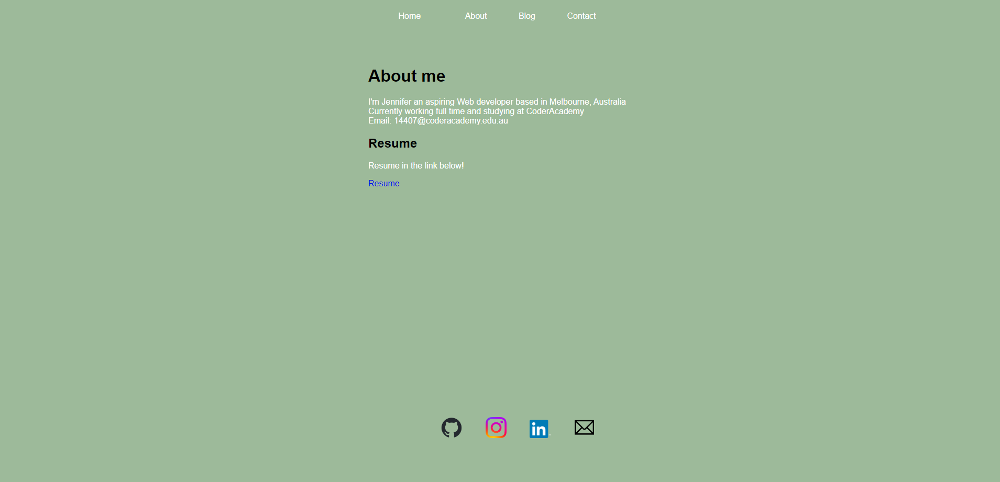
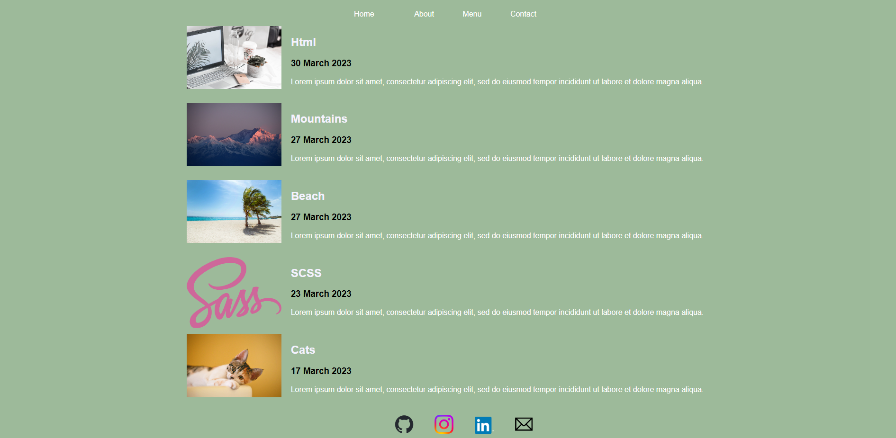
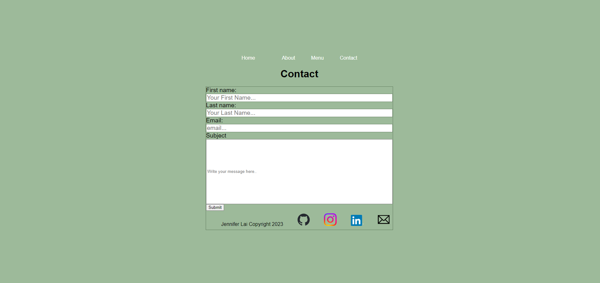

README.MD

A Website Portfolio 

Portfolio website built in HTML, CSS and SCSS 

Technologies Used
- Html5
- CSS
- SCSS
- Github
- Netlify to deploy 
- Sass

Links: 

Github: https://github.com/jennlai95
Github repo: https://github.com/jennlai95/Assignment-work-portfolio.git

Website URL: https://bright-cassata-d480f0.netlify.app

Description:
- this was built to show the technical skills, and responsive web design skills as part of the portfolio assignment T1A2

- a simple website design with plain background colour and white and black text 

- navigation bar to go to each part of the website as the header 

- dropdown menu when you hover the menu/blog. intended for easy viewing for mobile site view and also for general accessibility go to each blog post and page

- Target audience is for other aspiring web developers and students 

- Footer includes link to github and other dummy webpages

Table of content: 
Home page
About 
Contact
Blog page 
-> post 1
-> post 2
-> post 3
-> post 4
-> post 5

Footer

Sitemap

[label](sitemap.drawio)

Desktop Screenshots below:

External used :

footer logos: 
https://www.freepik.com/free-photos-vectors/

Beach phot from Pexels

Photo by Soumil Kumar: https://www.pexels.com/photo/photo-of-person-typing-on-computer-keyboard-735911/

Photo by Cong H from Pexels: https://www.pexels.com/photo/calico-cat-on-focus-photo-1404819/

Photo by Joyston Judah from Pexels: https://www.pexels.com/photo/white-and-black-mountain-wallpaper-933054/